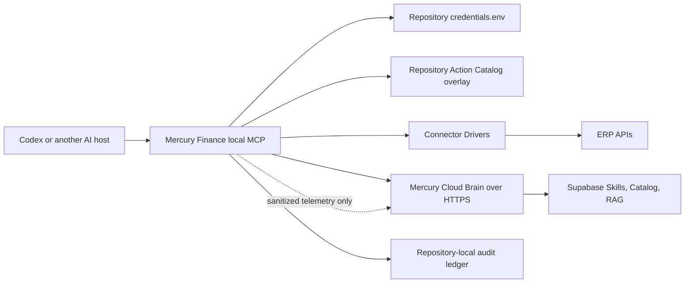

# Mercury Unified Local ERP MCP Design

**Status:** Approved design
**Date:** 2026-07-11
**Repository:** `mercury-tools`

## 1. Decision Summary

Mercury Finance will ship as one Codex plugin and one host-visible MCP server:

- Plugin name: `mercury-finance`
- MCP server name: `mercury-finance`
- MCP transport: local `stdio`
- Supported ERP methods: `GET`, `POST`, `PUT`, `PATCH`, and `DELETE`
- Execution model: ERP HTTP requests run on the user's machine
- Credential model: repository-local `.env` file, never stored in Mercury Cloud
- Mercury authentication: no manually entered Mercury Owner Token in v1
- Intelligence model: Skills, Action Catalog, connector documentation, and RAG
  knowledge are delivered from Mercury Cloud
- Connector model: normalized Action Catalog plus small connector-specific drivers
- UI model: Codex/AI-host plugin only; no Mercury web application

The existing `mercury-finance-private` plugin and separately registered private
MCP server will be removed. The journal-only write tools become normal catalog
actions orchestrated by a Mercury Skill.

## 2. Problem

The current product exposes a remote read-only MCP and a second private MCP for
three FlowAccount journal tools. That produces duplicate MCP registrations,
splits read and write behavior, stores connector credentials on the server, and
cannot scale to every documented ERP endpoint.

Mercury instead needs to act as an ERP-capable accounting agent runtime:

- The Cloud owns accounting intelligence and endpoint knowledge.
- Each repository owns its ERP credentials and local execution context.
- A small, stable MCP tool surface can operate every cataloged endpoint.
- New ERP specifications become usable without adding one MCP tool per endpoint.

## 3. Goals

1. Show exactly one Mercury MCP server in Codex.
2. Support every cataloged HTTP method and endpoint.
3. Keep ERP credentials on the user's machine and inside the selected repository.
4. Execute ERP requests from the user's machine, not Render.
5. Import OpenAPI, Swagger, Postman, and documentation-derived endpoints.
6. Make locally imported endpoints available immediately.
7. Keep the global catalog versioned in GitHub and queryable from Supabase.
8. Apply deterministic risk classification, preview, confirmation, hashing,
   idempotency, redaction, and audit rules to all mutations.
9. Preserve existing accounting Skills, knowledge retrieval, and Mercury Flows.
10. Provide explicit setup, status, test, and credential-clearing commands.

## 4. Non-Goals

- Mercury does not provide a local LLM.
- Mercury does not provide a browser-based setup or dashboard.
- Mercury Cloud does not store ERP API keys, client secrets, access tokens, or
  connector request payloads.
- The MCP does not expose a raw arbitrary-URL HTTP proxy.
- The MCP does not generate a separate tool for every endpoint.
- CI does not create, approve, pay, void, email, share, or delete production ERP
  records.

## 5. Architecture



### 5.1 Host-visible MCP

Codex loads one local `stdio` server from the `mercury-finance` plugin. The
server owns all knowledge, catalog, credential-status, read, write, and flow
tools presented to the model.

The Cloud service is a backend dependency of the local MCP. It is not registered
as a second MCP server by the plugin. A temporary remote compatibility endpoint
may remain during migration, but it is not part of the final plugin configuration
and cannot execute ERP operations.

### 5.2 Local Mercury runtime

The local runtime is responsible for:

- discovering the active repository root from MCP roots;
- reading non-secret repository configuration;
- loading credentials only when an ERP operation requires them;
- merging the global catalog with the repository-local catalog overlay;
- applying policy, validation, confirmation, and duplicate controls;
- invoking the selected connector driver;
- sending the ERP HTTP request locally;
- sanitizing output before returning it to the model;
- writing the local audit ledger; and
- sending optional payload-free telemetry to Mercury Cloud.

### 5.3 Mercury Cloud Brain

The Render/Supabase backend is responsible for:

- canonical Mercury Skills and workflow definitions;
- the global Action Catalog and immutable action versions;
- accounting, tax, finance, and ERP knowledge retrieval;
- connector documentation and endpoint dictionaries;
- sanitized aggregate catalog observations; and
- GitHub-driven global catalog ingestion.

Cloud endpoints used by the local runtime are read-only for ordinary plugin
users. Publishing to the global catalog is performed by trusted GitHub CI.

## 6. Repository-local State

Mercury creates this structure in the selected repository:

```text
.mercury/
|-- config.json
|-- credentials.env
|-- catalog/
|   |-- sources/
|   `-- actions/
|-- cache/
|   `-- catalog.sqlite
`-- audit/
    `-- audit_ledger.jsonl
```

### 6.1 Versioned and ignored files

- `.mercury/config.json` may be committed when it contains no secrets.
- `.mercury/catalog/` may be committed to share repository-specific endpoint
  definitions.
- `.mercury/credentials.env` must always be ignored.
- `.mercury/cache/` and `.mercury/audit/` must be ignored by default.

Mercury adds these exact entries without replacing unrelated `.gitignore`
content:

```gitignore
.mercury/credentials.env
.mercury/cache/
.mercury/audit/
```

### 6.2 Root selection

The local MCP uses MCP roots as the source of truth. When one repository root is
active, Mercury selects it automatically. When multiple roots are active,
Mercury requires an explicit selection before reading credentials or executing
an ERP action. A requested path must resolve inside an MCP root.

## 7. Local Credential Lifecycle

### 7.1 Commands

```bash
mercury credentials setup flowaccount --env production
mercury credentials setup peak --env production
mercury credentials status
mercury credentials test flowaccount --env production
mercury credentials clear flowaccount --env production
mercury credentials clear --all
mercury doctor
```

Setup uses an interactive terminal prompt with hidden secret input. Credentials
must never be supplied as MCP tool arguments or ordinary chat content.

### 7.2 File format

Environment keys follow this deterministic format:

```text
MERCURY_<CONNECTOR>_<ENVIRONMENT>_<FIELD>
```

Examples of field names, without values:

```dotenv
MERCURY_FLOWACCOUNT_PRODUCTION_CLIENT_ID=
MERCURY_FLOWACCOUNT_PRODUCTION_CLIENT_SECRET=
MERCURY_PEAK_PRODUCTION_CONNECT_ID=
MERCURY_PEAK_PRODUCTION_CONNECT_KEY=
MERCURY_PEAK_PRODUCTION_APPLICATION_CODE=
MERCURY_PEAK_PRODUCTION_USER_TOKEN=
```

The dotenv writer must quote values safely, reject embedded control characters,
write through a same-directory temporary file, set mode `0600`, and replace the
target atomically. The `.mercury` directory uses mode `0700` where supported.
On platforms without POSIX permissions, `doctor` must report the weaker boundary.

### 7.3 Status, test, and clear

- `status` reports connector, environment, required field names, and present or
  missing state. It never returns values.
- `test` performs connector authentication followed by the driver's declared
  safe read probe.
- `clear <connector>` removes only matching keys and atomically rewrites the
  file.
- `clear --all` removes the credentials file and invalidates all
  in-memory credential state.
- After clear, every ERP read or write fails with `credentials_required`.

The runtime must not cache raw credentials beyond the current operation.

## 8. Dynamic Action Catalog

### 8.1 Cloud schema

Supabase adds these product tables:

- `erp_spec_sources`: source type, URI/path, connector, document hash, version,
  import metadata, and sanitization result;
- `erp_action_catalog`: stable action identity and current active version;
- `erp_action_versions`: immutable normalized endpoint definitions;
- `erp_action_observations`: sanitized success, failure, and response-shape
  observations with no request payload or credentials.

Service-role writers publish global records. Ordinary plugin users have read-only
access through the Cloud service, not direct table credentials.

### 8.2 Action identity

An action identity includes:

- connector ID;
- HTTP method;
- canonical path template;
- operation ID or generated operation name; and
- variant ID when one endpoint accepts materially different payload shapes.

This preserves FlowAccount examples where one path appears multiple times for
simple, inline, VAT, payment, or document-type variants.

### 8.3 Required action fields

Every normalized action contains:

- stable `action_id` and immutable version ID;
- connector and supported environments;
- method, canonical path, and content type;
- Thai and English intent aliases;
- capability such as `documents.invoice.payment.create`;
- path, query, header, and body schemas;
- required fields and examples;
- risk tier, side effects, and required confirmation count;
- preflight action references;
- idempotency and duplicate-detection strategy;
- success and error interpretation rules;
- response sanitizer rules;
- source URI/path, source hash, and imported version;
- confidence: `exact`, `example_derived`, or `inferred`; and
- observed state: `untested`, `success`, `failed`, or `outcome_unknown`.

### 8.4 Import paths

Direct MCP import is local:

1. The local MCP reads a file inside an active MCP root or fetches an explicitly
   supplied HTTPS URL.
2. It scans and removes credentials, cookies, tokens, and personal examples.
3. It parses OpenAPI 3.x, Swagger 2, Postman Collection 2.1, or documentation
   text in that order of confidence.
4. It writes normalized source and action JSON under `.mercury/catalog/`.
5. The new actions become available in that repository immediately.

For a connector host that is not already pinned by a built-in driver, setup must
show the exact scheme and base host and require explicit trust before saving it
to `.mercury/config.json`. Importing a specification alone does not trust its
host or authorize credentials to be sent there.

GitHub import is global:

1. Specifications or reviewed local catalog files are committed to the repo.
2. CI validates and sanitizes them.
3. CI publishes immutable action versions to Supabase.
4. Local Mercury runtimes receive the new global catalog on refresh.

Direct imports cannot mutate the shared global catalog. This avoids requiring a
Mercury user token while preventing an arbitrary plugin user from changing every
user's catalog.

### 8.5 Search ranking

`search_erp_actions` ranks candidates by:

1. exact action ID or capability;
2. exact intent alias;
3. selected connector and accounting object;
4. keyword/full-text score; and
5. semantic similarity as a secondary signal.

The model must not choose an action when the top candidates remain ambiguous.
It returns safe candidate summaries and asks the user to select one.

## 9. Connector Drivers

Endpoint behavior remains data-driven. Connector drivers contain only behavior
that cannot be represented safely as catalog data.

Each driver implements:

- credential field schema;
- environment/base URL resolution;
- credential validation and safe probe;
- token acquisition or signature generation;
- request header preparation;
- multipart/file preparation where required;
- provider-specific success/error interpretation;
- response redaction; and
- optional status lookup after an uncertain mutation.

Initial drivers:

- FlowAccount OAuth client credentials;
- PEAK HMAC-SHA1 client-token flow;
- generic bearer token;
- generic API key header or query parameter;
- HTTP Basic authentication; and
- generic OAuth client credentials.

An ERP with a new standard auth pattern can use a generic driver immediately.
Only a non-standard authentication or response protocol requires a new small
driver release.

## 10. Unified MCP Tool Surface

The existing knowledge, accounting Skill, connector-status, and Mercury Flow
tools remain available from the one local MCP.

The ERP gateway adds:

- `search_erp_actions(query, connector=None, method=None, risk_tier=None)`
- `get_erp_action_schema(action_id, version=None)`
- `run_erp_read(repo_root, action_id, inputs)`
- `preview_erp_write(repo_root, action_id, inputs)`
- `confirm_erp_write(repo_root, request_id, payload_hash)`
- `execute_erp_write(repo_root, request_id)`
- `get_erp_request_status(repo_root, request_id)`
- `import_erp_spec(repo_root, source_path=None, source_url=None)`
- `list_connector_drivers()`
- `credential_status(repo_root, connector=None, environment=None)`

Credential creation and clearing remain interactive CLI commands so secrets do
not pass through model-visible MCP arguments.

The following private-only tools are removed from the exposed contract:

- `preview_flowaccount_journal`
- `create_flowaccount_journal_draft`
- `approve_flowaccount_journal`

The FlowAccount journal Skill instead discovers and runs catalog actions through
the generic tools.

## 11. Execution Policy

### 11.1 Supported methods

The executor supports `GET`, `POST`, `PUT`, `PATCH`, and `DELETE`. It only sends
requests whose method, host, path template, parameters, and body are represented
by an active global or local catalog action.

There is no tool that accepts an arbitrary URL.

### 11.2 Risk tiers

| Tier | Operations | Confirmations |
| --- | --- | ---: |
| 0 | GET and safe lookups | 0 |
| 1 | Create, normal update, PUT/PATCH, attachment | 1 |
| 2 | Payment, approve, void, DELETE, email, share, invite | 2 |
| 2 | Newly inferred and never-observed mutation | 2 |

The classifier may raise an action to a higher tier but never lower an explicit
catalog tier at runtime.

### 11.3 Preview binding

A write preview resolves and stores:

- repository identity;
- connector and environment;
- action ID and immutable version;
- method and final URL path;
- sanitized query/header/body summary;
- payload SHA-256;
- risk tier and required confirmations;
- idempotency or duplicate-check fields; and
- preview expiration.

Confirmation binds to the preview request ID and payload hash. Any change to the
action version, method, path, query, body, connector, environment, or repository
invalidates existing confirmations and requires a new preview.

### 11.4 State machine

```text
previewed
  -> awaiting_confirmation
  -> awaiting_final_confirmation (Tier 2 only)
  -> ready_to_execute
  -> executing
  -> succeeded | failed | outcome_unknown
```

The executor loads credentials only after policy and confirmation checks pass.

### 11.5 Network boundary

- HTTPS is required for production internet endpoints.
- The final host must equal the connector driver's selected base host.
- Redirects to another host are rejected.
- Path traversal and unresolved path variables are rejected.
- File inputs and attachments must resolve inside an active MCP root.
- Link-local and cloud metadata addresses are always blocked.
- Loopback/private-network targets require an explicit repository setting for a
  local or gateway connector and are never inferred automatically.

## 12. Idempotency and Failure Handling

- Use the ERP's idempotency key when documented.
- Otherwise use cataloged business references and preflight duplicate checks.
- Never retry a mutation automatically after request dispatch.
- A timeout, disconnect, or 5xx after dispatch becomes `outcome_unknown`.
- `outcome_unknown` blocks replay of the same request hash.
- The driver must use a documented status/read action before the operator can
  create a replacement request.
- Provider body-level statuses are authoritative when the provider can return a
  transport success with a business failure. PEAK `resCode` is an initial case.
- Sanitized errors may include method, action ID, provider status class, and
  remediation, but never credentials or raw sensitive payloads.

## 13. Audit and Privacy

The local JSONL ledger records:

- timestamp and local session ID;
- repository, connector, and environment identifiers;
- action/version, method, and risk tier;
- payload hash and redacted input summary;
- confirmation events;
- dispatch and completion state;
- sanitized provider response summary; and
- local output artifact path when one exists.

It never records raw credentials, authorization headers, cookies, or access
tokens. Tax IDs, email addresses, and personal fields are redacted by default.

Cloud telemetry is payload-free and optional. It may contain action/version,
connector, method, latency, status class, and an opaque event ID. It cannot
contain repository paths, credentials, business payloads, provider record data,
or local audit artifacts.

## 14. Packaging

`plugins/mercury-finance/.mcp.json` registers one local `stdio` server. The
launcher starts the version-pinned Mercury Python runtime from the plugin release.
The packaging plan must make installation reproducible and must not execute code
from a moving branch at runtime.

For the contest release, a pinned Git tag or immutable commit is acceptable.
The longer-term distribution target is a signed standalone launcher or a pinned
Python package release. `mercury doctor` reports missing runtime prerequisites
before the user attempts connector setup.

The plugin includes only routing/usage instructions needed for Codex to discover
Mercury. Canonical Skills remain in Mercury Cloud and are exposed by the local
MCP as prompts/resources and through `run_accounting_skill`.

## 15. Migration

1. Add the local MCP mode and Cloud Brain client.
2. Add repository discovery, local config, credential commands, and local audit.
3. Add cloud/local Action Catalog schemas and importers.
4. Add the generic executor and connector driver interface.
5. Port FlowAccount and PEAK to drivers and catalog actions.
6. Replace journal-specific write tools with catalog-backed Skill execution.
7. Change `mercury-finance` to one local MCP registration.
8. Remove `mercury-finance-private` from the marketplace and local installation.
9. Re-run local credential setup for connected ERPs.
10. Verify local credentials, then delete connector secret vault data from
    Supabase and the private bearer token from Render and local Keychain.
11. Keep only non-secret connector metadata in Supabase.

No server-stored credential is copied down automatically.

## 16. Testing

### 16.1 Unit tests

- OpenAPI 3.x, Swagger 2, Postman 2.1, and documentation import;
- secret scanning and source sanitization;
- action normalization, identity, variants, and immutable versions;
- deterministic search ranking and ambiguity handling;
- risk classification for every method and side-effect class;
- dotenv quoting, atomic writes, permissions, status, and selective clear;
- repository root validation and multi-root selection;
- driver authentication and response interpretation with mocked HTTP;
- payload hashing and confirmation invalidation;
- duplicate and idempotency rules;
- SSRF, redirect, traversal, and private-network controls;
- response and audit redaction; and
- `outcome_unknown` replay blocking.

### 16.2 Integration tests

- a fresh temporary repository creates the expected `.mercury` state;
- clearing credentials immediately blocks all connector actions;
- global and local catalog actions merge with deterministic precedence;
- the local MCP exposes knowledge and ERP tools from one server;
- FlowAccount sandbox authentication and a safe GET probe;
- PEAK UAT authentication and a safe GET probe when credentials are available;
- write previews use mocked or sandbox records only; and
- sanitized cloud catalog/audit calls contain no secrets or business payloads.

### 16.3 Packaging tests

- marketplace validation passes;
- a clean Codex home installs only `mercury-finance`;
- `codex mcp list` shows one Mercury MCP entry;
- the installed MCP starts without the source repository present; and
- plugin/runtime versions are pinned and reproducible.

## 17. Acceptance Criteria

1. Installing `mercury-finance` produces one enabled Mercury MCP entry.
2. `mercury-finance-private` is absent from the marketplace and local config.
3. A fresh repository can complete interactive FlowAccount or PEAK setup.
4. Setup creates `.mercury/credentials.env` with correct ignore and permission
   controls.
5. Restarting Codex reuses the repository credentials without prompting again.
6. FlowAccount and PEAK endpoint dictionaries are searchable as executable
   Action Catalog records.
7. Locally imported specifications become usable immediately in that repository.
8. GET actions execute without confirmation.
9. POST, PUT, PATCH, and DELETE follow the approved tiered confirmation policy.
10. ERP network traffic originates from the local runtime.
11. No ERP credential exists in Supabase, Render, Git, RAG, Skills, logs, or
    model-visible tool arguments.
12. `credentials clear` blocks subsequent ERP execution immediately.
13. Full tests, Ruff, plugin validation, and clean-install smoke tests pass.
14. The product requires no Mercury web UI and no local LLM.

## 18. Explicit Trade-offs

- Immediate production execution of inferred actions is intentionally allowed.
  Such actions are always Tier 2 until a successful observation exists.
- Repository-local credentials improve isolation but require setup per repository
  and do not automatically follow a user to another machine.
- A dotenv file is not a hardware-backed vault. Any local process or agent with
  the same operating-system file privileges can read it; mode `0600`, root
  scoping, ignore rules, redaction, and short-lived provider tokens reduce but do
  not eliminate that local trust assumption.
- Local execution keeps credentials off Mercury Cloud but requires a packaged
  local runtime and shifts ERP network reachability to the user's machine.
- Direct MCP imports remain local because allowing unauthenticated global catalog
  writes would let one user affect all users.
- A stable generic tool surface is less visually explicit than hundreds of
  endpoint-specific tools; Mercury Skills and action search provide the human-
  readable workflow layer.
