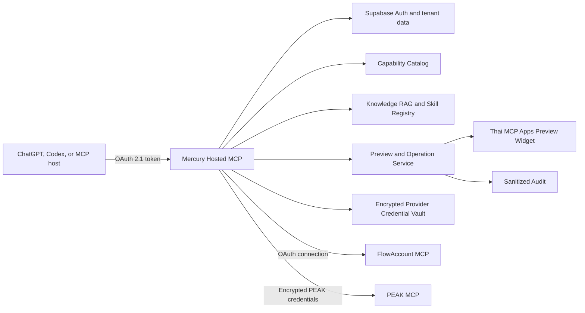

# Mercury V1 Authorization Gateway Design

Status: Approved design sections, written spec pending user review
Date: 2026-07-25
Target release: `v1.0.0`
Repository: `mercury-tools`

## 1. Executive Summary

Mercury V1 is one hosted, product-facing MCP server that lets a user connect an
accounting provider, ask finance and accounting questions, and create supported
accounting documents through a controlled preview and confirmation flow.

The host supplies the reasoning LLM. Mercury supplies:

- a stable MCP tool contract
- FlowAccount and PEAK authorization and provider routing
- a reviewed, versioned capability catalog
- cited accounting and provider knowledge
- versioned accounting Skills
- Thai document previews
- explicit approval, idempotency, reconciliation, and audit

Mercury does not replace FlowAccount or PEAK. It is the accounting control and
knowledge layer between an AI host and the provider systems.

The V1 create lifecycle is:

`Draft -> Validate -> Thai HTML Preview -> Explicit confirmation -> Provider Create -> Audit`

Only an exact provider capability version that has passed qualification is
executable. Discovery or RAG content alone never grants execution authority.

## 2. Current Baseline and Target State

The repository currently publishes `v0.3.1` as a public, unauthenticated Hosted
MCP focused on knowledge, connector metadata, Skills, and read-only planning.
It does not hold per-user provider credentials or execute the approved V1
provider create lifecycle.

V1 changes that boundary:

- the one-click plugin installation remains simple
- the first protected use starts Mercury OAuth 2.1 authorization
- each user receives tenant-bound workspace and connection state
- provider authorization is completed out of band
- qualified provider reads and document creates execute through Mercury
- unauthenticated public health, privacy, terms, and support routes remain
  available
- business MCP tools require Mercury authorization

Statements in the current README that the MCP requires no authentication and
that provider authorization remains entirely in the host are superseded by
this target design for `v1.0.0`.

## 3. Goals

1. Let users install one Mercury plugin and use it from ChatGPT, Codex, or
   another compatible MCP host.
2. Support FlowAccount and PEAK through one stable Mercury-facing contract.
3. Support provider reads and every discovered, schema-validated, qualified
   document-create capability.
4. Keep provider credentials out of chat, model context, widgets, RAG, logs,
   audit output, and Git.
5. Require a human-readable Thai preview and explicit confirmation before every
   provider create.
6. Prevent duplicate documents after repeated confirmation, timeout, or
   ambiguous provider outcomes.
7. Enable and disable provider behavior one capability at a time.
8. Keep accounting knowledge cited, reviewable, and separate from execution
   authority.

## 4. V1 Scope

### In Scope

- one product-facing Streamable HTTP MCP server
- Supabase Auth OAuth 2.1 authorization for the Mercury MCP
- FlowAccount provider-owned OAuth, consent, and company selection
- PEAK provider-issued User Token, Connect ID, and Connect Key onboarding
- tenant-bound provider connection records
- encrypted provider credential vault
- downstream provider MCP discovery and calls
- exact-schema Mercury read and document-create-prepare tools
- immutable previews, Thai HTML widget, confirmation, and sanitized audit
- FlowAccount and PEAK capability qualification
- cited RAG and versioned accounting Skills
- single-document and controlled batch creates
- one-click plugin installation

### Out of Scope

- provider update, patch, delete, void, payment, approval, or other
  non-create mutations
- direct provider MCP exposure to the host
- provider token passthrough
- automatic execution selected by semantic search
- automatic ingestion of company records into RAG
- Express Account cloud execution
- Mercury-owned LLM inference
- a standalone accounting web application
- a separate release-control repository

Express Account remains a future customer-operated Local Bridge until a
supported public authorization and execution contract is available.

## 5. Architecture



Mercury has two protocol roles:

- an MCP server for the host
- an internal MCP client for FlowAccount and PEAK

The provider MCP servers are connector drivers, not products exposed by the
Mercury plugin.

## 6. Component Responsibilities

### 6.1 Mercury Hosted MCP

- validates the Mercury access token
- bootstraps and resolves the user, tenant, workspace, and scopes
- publishes stable core tools
- exposes only enabled typed provider wrappers
- routes Skills, RAG, previews, confirmations, and operation status
- returns structured and sanitized outputs

### 6.2 Mercury Authorization Service

Supabase Auth acts as the Mercury OAuth 2.1 and OIDC authorization server.
Mercury uses:

- authorization code with PKCE
- OAuth/OIDC discovery from
  `https://vbnlkqvauqwnjbxngkas.supabase.co/auth/v1`
- a pre-registered client for the public Mercury plugin
- dynamic client registration for compatible third-party MCP hosts
- asymmetric JWT signing and JWKS validation
- refresh-token rotation
- Row Level Security and tenant checks

The canonical MCP resource is
`https://mercury-tools-mcp.onrender.com/mcp`. Mercury publishes RFC 9728
protected-resource metadata at both the root and path-compatible well-known
locations and points it to the Supabase authorization server. A custom access
token hook binds the token audience to the canonical MCP resource.

OAuth requests use `openid email profile`. Mercury workspace roles and
provider-operation permissions are enforced by tenant membership, RLS, and
application policy rather than treating identity scopes as accounting
permissions. Redirect URIs must be exact pre-registered HTTPS URLs or valid
localhost callback URLs for supported local MCP clients; wildcards are not
allowed.

The MCP server validates issuer, audience, signature, expiry, subject,
`client_id`, and tenant membership on every protected request. A failed
authorization returns `401` plus a standards-compliant `WWW-Authenticate`
challenge; an authenticated user without required workspace permission receives
`403`.

### 6.3 Workspace Bootstrap Service

The first request carrying a valid Mercury identity runs one idempotent database
transaction that:

- creates the user's personal tenant when none exists
- creates one default workspace when none exists
- creates an owner membership for that user
- marks the default workspace as active

`get_mercury_context` accepts an empty object and returns the active
`workspace_id`, the user's sanitized workspace memberships, and the next
allowed actions. It never returns an access token, email address, or provider
credential. Every workspace-bound tool continues to require the explicit
`workspace_id` returned by this tool so calls cannot silently switch companies
or tenants.

V1 creates at most one automatic personal workspace per user. Additional
organization workspaces require an explicit membership or later workspace
administration capability. Repeating bootstrap or `get_mercury_context` is
idempotent and never creates a provider connection.

### 6.4 Provider Connection Service

- starts FlowAccount OAuth or PEAK secure setup
- binds one provider connection to one tenant, workspace, provider account,
  company or merchant, environment, and user
- validates the provider connection before marking it ready
- refreshes FlowAccount authorization where supported
- validates and revokes PEAK credentials through supported provider behavior
- disconnects and removes usable credential material

### 6.5 Encrypted Provider Credential Vault

Provider authorization material is isolated from RAG, Skills, previews, and
audit.

The vault stores:

- FlowAccount access token, refresh token, expiry, granted scopes, selected
  company, and provider connection identifiers
- PEAK User Token, Connect ID, Connect Key, merchant binding, and provider
  connection identifiers

Credential envelopes use authenticated encryption such as AES-256-GCM. The
Render secret store supplies the active master key. Each encrypted value is
bound as additional authenticated data to:

- tenant
- Mercury user
- workspace
- provider
- provider company or merchant
- environment
- credential type
- key version

Access tokens may be cached in process memory for their short lifetime. Static
or refreshable secrets remain encrypted at rest. Rotation supports an active
and previous key version during a bounded migration window.

### 6.6 Capability Catalog

The catalog is the only execution authority. It stores:

- provider and environment
- downstream tool or endpoint identity
- normalized capability and action class
- exact input and output schemas
- immutable version hash
- required scopes or provider permissions
- response-shape evidence
- qualification evidence and expiry
- status and disable reason
- idempotency and reconciliation behavior

### 6.7 Knowledge RAG

RAG stores reviewed accounting standards, Thai tax guidance, provider
documentation, and workflow references with:

- source title and URI
- citation fragment
- jurisdiction
- provider
- document type
- effective date
- review status
- version and content hash

PostgreSQL full-text search is the required V1 retrieval path. Real semantic
embeddings are optional. Deterministic hash embeddings remain test-only.

All knowledge tools require a valid Mercury identity and an explicit
`workspace_id`. Globally reviewed first-party content is visible to every
authorized workspace. Workspace-owned content is returned only to members of
that workspace after it has been explicitly published. Draft, rejected, and
another tenant's content never appears in normal search results. RLS and the
application query both enforce this boundary.

### 6.8 Skill Registry

Each published Skill declares:

- exact input and output schemas
- required and optional capabilities
- allowed and blocked action classes
- evidence requirements
- accountant review points
- RAG filters and citation requirements
- provider-neutral workflow policy

Git is canonical for first-party Skills. Supabase stores the published,
versioned projection. Uploaded workspace Skills remain drafts until validated
and explicitly published.

### 6.9 Preview and Operation Service

- creates immutable preview records
- renders sanitized Thai previews
- records explicit confirmation
- dispatches the exact stored provider request
- serializes duplicate or concurrent confirmation
- reconciles uncertain provider outcomes
- records sanitized audit events

### 6.10 Downstream Provider Driver Runtime

V1 provider drivers use Streamable HTTP MCP only. Each provider has a
server-controlled, versioned manifest at:

`catalog/global/<provider>/driver.json`

The manifest contains no secret and declares:

- provider and supported environments
- exact downstream MCP resource URI for each environment
- transport and supported MCP protocol version
- authentication adapter
- callback identity when OAuth is used
- discovery, read, and create timeout classes
- provider tool-name to normalized-capability mappings

Provider resource URIs are deployment configuration, never model input or RAG
output. Production may use a Render environment override for a staged endpoint,
but readiness and qualification record the resolved URI hash. A missing,
changed, or unverified URI keeps the driver unavailable.

Mercury initializes one downstream MCP session per provider connection and
operation. A session ID or connection pool is never shared across tenants,
users, provider connections, or environments. The runtime honors downstream
MCP session headers, performs `initialize` before discovery or calls, and drops
the session after the operation unless a short-lived same-connection session is
explicitly safe.

The default network limits are:

- 5 seconds to establish a connection
- 30 seconds for discovery and read calls
- 60 seconds for one create dispatch
- no automatic create retry after possible dispatch

FlowAccount uses the downstream MCP OAuth adapter. It discovers protected
resource and authorization-server metadata, uses authorization code with PKCE,
and sends the resulting access token only in the downstream `Authorization`
header. PEAK uses the provider-key adapter; it derives or injects required
provider transport headers from the encrypted connection without adding secret
fields to public tool arguments. A PEAK application code, if required by the
registered integration, is server-owned Render configuration rather than a
fourth user-entered secret.

Raw downstream tool names, session identifiers, headers, credentials, and error
bodies are never returned to the host. The catalog mapping and exact response
normalizer are the only bridge into the public Mercury response contract.

### 6.11 Plugin Distribution Contract

V1 keeps the repository's existing distribution surfaces:

- `plugins/mercury-finance/.codex-plugin/plugin.json`
- `plugins/mercury-finance/.mcp.json`
- `.agents/plugins/marketplace.json`
- `chatgpt-app-submission.json`
- `submission/openai-plugin/`

Every V1 artifact declares version `1.0.0`, points to the canonical Hosted MCP
resource, and removes the superseded claim that Mercury stores no provider
authorization or never calls an ERP. The plugin bundle contains no OAuth client
secret, Supabase key, Render secret, or provider credential.

The host discovers Mercury authorization from the Hosted MCP; the GitHub plugin
manifest does not carry a copied bearer token. The public OpenAI client and any
other pre-registered client have exact redirect URIs registered in Supabase.
Their non-secret client IDs, redirect URIs, and MCP resource are exported to:

`deployment/mercury-oauth-clients.public.json`

CI validates that this public deployment record, plugin manifests, OpenAI
submission artifacts, and protected-resource metadata all reference the same
MCP resource and V1 version. Exact host-issued redirect URIs are copied from the
host registration; wildcards are rejected. A clean-profile installation test
must prove that installation succeeds first and the first protected tool call
starts OAuth without manual token entry.

## 7. Provider Authorization

### 7.1 Mercury Host Authorization

Plugin installation does not ask for a manually copied Mercury token. When a
protected tool is first used:

1. the MCP host discovers the Mercury OAuth resource and authorization server
2. the host starts authorization code with PKCE
3. the user signs in to Mercury and approves the requested access
4. Supabase Auth issues a Mercury-scoped token
5. the host sends that token only to Mercury
6. Mercury idempotently creates or resolves the user's default workspace
7. the host calls `get_mercury_context` to obtain the explicit `workspace_id`

The public plugin client is pre-registered. Other compatible clients may use
Supabase dynamic client registration. The user-facing sign-in and consent page
is hosted at the configured Mercury authorization path on Render and shows the
requesting client, identity scopes, and Mercury workspace access before
approval.

All business MCP tools require a valid Mercury identity. Public non-MCP routes
remain limited to health, legal, support, and authorization metadata.

### 7.2 FlowAccount

1. `start_provider_connection(provider="flowaccount")` verifies the
   server-controlled driver manifest and creates a signed, ten-minute,
   single-use connection attempt with PKCE state.
2. Mercury performs downstream MCP protected-resource and authorization-server
   discovery, then returns the provider authorization URL.
3. The user signs in on FlowAccount, grants the challenged scopes allowed by
   the driver manifest, and selects one company.
4. FlowAccount redirects to the exact registered callback:
   `https://mercury-tools-mcp.onrender.com/auth/providers/flowaccount/callback`.
5. Mercury validates state, PKCE, callback, environment, user, and workspace
   binding before exchanging the authorization code.
6. Mercury stores encrypted provider tokens and any dynamic client registration
   secret, resolves the selected company, and destroys transient verifier
   material.
7. Mercury performs downstream tool discovery and safe read validation.
8. The connection becomes ready only after exact validation passes.

The deployer configures the FlowAccount downstream MCP resource URI per
environment plus any provider-issued Mercury client ID or client secret in
Render. A client secret is required only when the provider registers Mercury as
a confidential client; it is never stored in Git or Supabase general config.
Requested scopes come from the downstream `WWW-Authenticate` challenge and are
intersected with the reviewed allowlist in `driver.json`. OAuth endpoints,
scopes, and callback values are never inferred from RAG or supplied by the
model. Missing or mismatched configuration makes FlowAccount unavailable at
readiness rather than falling back to another environment.

### 7.3 PEAK

PEAK's public MCP setup uses provider-issued credentials rather than public
OAuth.

1. `start_provider_connection(provider="peak")` creates a signed, one-time,
   short-lived setup session.
2. Mercury directs the user to create an MCP key in PEAK.
3. The user submits User Token, Connect ID, and Connect Key through a secure
   Mercury setup page.
4. Credential values are posted directly to the Mercury backend over HTTPS.
   They never enter chat, tool arguments visible to the model, or widget state.
5. Mercury validates the merchant and user binding through a safe PEAK call.
6. Mercury encrypts the credentials and destroys the plaintext setup payload.
7. The connection becomes ready only after exact validation passes.

The secure setup page is an authorization handoff, not a general accounting
web application.

The V1 setup contract is:

- `start_provider_connection` stores only a SHA-256 hash of a 256-bit random
  setup token, bound to tenant, Mercury user, workspace, provider, environment,
  and a ten-minute expiry
- the returned HTTPS URL carries the plaintext setup token only in the fragment,
  never the query string; the first-party page reads it into memory, immediately
  calls `history.replaceState` to remove it from browser history, and submits it
  once over HTTPS without using local or session storage
- the page uses `Referrer-Policy: no-referrer`, `Cache-Control: no-store`, and
  no analytics
- the browser must authenticate as the same Mercury user before the form is
  shown
- the form uses a server-issued CSRF token, strict origin validation, a narrow
  CSP, password-style secret inputs, and no third-party resources
- Render and reverse-proxy access logs exclude the setup query and request body
- the POST handler validates and encrypts credentials before persistence,
  marks the setup token consumed in the same transaction, and never returns
  credential values
- a consumed, expired, mismatched, or replayed setup token is rejected
- plaintext values are held only for validation and encryption and are removed
  from request-scoped references immediately afterward

MCP URL-mode elicitation may be added later as another client for this same
one-time setup contract, but it is not a second V1 credential path.

Disconnect always deletes Mercury's usable credential envelope. If a provider
supports remote revocation, Mercury also invokes it. If PEAK requires the user
to revoke an MCP key in PEAK, Mercury returns exact provider instructions and a
`provider_revocation_required` status after local credential deletion.

## 8. Capability Lifecycle

```text
discovered_unreviewed
        -> schema_validated
        -> nonproduction_qualified
        -> enabled
        -> disabled or superseded
```

An action becomes `enabled` only after:

- downstream discovery
- action classification
- exact input and output schema validation
- required provider authorization mapping
- response-shape validation
- sanitization review
- provider-appropriate non-production evidence
- idempotency and reconciliation classification for creates
- release review

Qualification is bound to provider, environment, action, and immutable version.
A changed schema produces a new version in `discovered_unreviewed`; it never
inherits executable status automatically.

Only reads and document creates can reach `enabled` in V1. Other mutation
classes remain hidden even when discovered. A production capability version
must also pass the owner-authorized production canary before it becomes
`enabled`; non-production evidence alone never authorizes production execution.

### 8.1 V1 Seed Catalog

The existing source-controlled provider catalogs remain the discovery baseline:

- `catalog/global/flowaccount/actions.json`
- `catalog/global/flowaccount/semantic-contracts.json`
- `catalog/global/flowaccount/source.json`
- `catalog/global/peak/actions.json`
- `catalog/global/peak/semantic-contracts.json`
- `catalog/global/peak/source.json`

The first implementation plan must qualify these normalized capabilities for
both providers:

- `provider_profile.get`
- `documents.invoice.list`
- `documents.invoice.get`
- `documents.invoice.create`

The provider driver manifest maps those normalized IDs to the exact discovered
downstream tools. The selected tool name, request schema, response schema,
environment, and immutable version are recorded in:

`catalog/global/<provider>/qualifications/<capability-version>.json`

These four capabilities are the deterministic release seed, not a claim that an
unqualified endpoint works. Every other discovered capability matching
`documents.<document_type>.create` is imported as
`discovered_unreviewed` and may be enabled one at a time after the same
qualification. Payment, approval, update, void, delete, email, share,
attachment, master-data, and status-changing capabilities are not document
creates and remain hidden in V1.

## 9. MCP Tool Contract

### 9.1 Stable Core Tools

| Tool | Purpose | Mutation |
| --- | --- | --- |
| `get_mercury_context` | Bootstrap and return the active workspace context | Idempotent Mercury state |
| `list_accounting_providers` | List supported provider connection methods | No |
| `start_provider_connection` | Begin FlowAccount OAuth or PEAK secure setup | Mercury state |
| `list_provider_connections` | List tenant-visible sanitized connections | No |
| `connector_status` | Return exact connection and capability readiness | Audit only |
| `list_provider_capabilities` | List enabled and unavailable capability states | No |
| `get_capability_schema` | Return one exact reviewed schema | No |
| `search_knowledge` | Search cited reviewed knowledge | Audit only |
| `retrieve_context_pack` | Build a cited task context pack | Audit only |
| `run_accounting_skill` | Execute qualified reads and prepare allowed create previews | Provider reads / Mercury state |
| `prepare_document_create` | Validate and persist an immutable create preview | Mercury state |
| `render_document_preview` | Render one stored preview | No |
| `confirm_document_create` | Dispatch one explicitly confirmed stored preview | Provider create |
| `get_operation_status` | Read operation and reconciliation state | Audit only |
| `disconnect_provider` | Revoke and remove a provider connection | Mercury/provider auth state |

Every tool has:

- an explicit JSON input schema
- an explicit JSON output schema
- enums, bounds, formats, and mutual-exclusion rules
- accurate read-only, destructive, open-world, and idempotency annotations
- deterministic public error codes

No public tool accepts an undocumented free-form `object`.

The normative V1 input contracts are:

| Tool | Required input |
| --- | --- |
| `get_mercury_context` | Empty object |
| `list_accounting_providers` | Empty object |
| `start_provider_connection` | `workspace_id: uuid`, `provider: flowaccount or peak`, and provider-discriminated `environment` |
| `list_provider_connections` | `workspace_id: uuid` |
| `connector_status` | `workspace_id: uuid`, `connection_id: uuid` |
| `list_provider_capabilities` | `workspace_id: uuid`, `connection_id: uuid` |
| `get_capability_schema` | `workspace_id: uuid`, `capability_id: catalog identifier`, `capability_version: sha256 version identifier` |
| `search_knowledge` | `workspace_id: uuid`, `query: 1..2000 characters`, typed `filters`, `top_k: 1..20`, `mode: keyword or hybrid` |
| `retrieve_context_pack` | `workspace_id: uuid`, `query: 1..2000 characters`, optional published `skill_id`, typed `filters`, `max_chunks: 1..20` |
| `run_accounting_skill` | A generated discriminated union keyed by published `skill_id` and `skill_version`; every branch contains `workspace_id` plus that Skill's exact required inputs, and requires `connection_id` when provider data is used |
| `prepare_document_create` | A generated discriminated union keyed by `capability_id` and `capability_version`; every branch contains the exact qualified document schema plus `workspace_id` and `connection_id` |
| `render_document_preview` | `workspace_id: uuid`, `preview_id: uuid` |
| `confirm_document_create` | `workspace_id: uuid`, `preview_id: uuid`, `state_version: integer >= 1`, `confirmation: "CONFIRM_CREATE"` |
| `get_operation_status` | `workspace_id: uuid`, `operation_id: uuid` |
| `disconnect_provider` | `workspace_id: uuid`, `connection_id: uuid`, `confirmation: "DISCONNECT"` |

Knowledge filters are a closed object with only `jurisdiction`, `provider`,
`doc_type`, `review_status`, `effective_on`, `source_id`, and
`capability_version`. Unknown keys are rejected. Provider and environment use
`oneOf` branches so FlowAccount accepts only catalog-supported
`sandbox|production` values and PEAK accepts only catalog-supported
`uat|production` values. An unavailable environment is omitted from the
published branch rather than accepted and rejected later.

`run_accounting_skill` and `prepare_document_create` never publish a bare
`inputs: object`. Their `oneOf` branches are generated from the same immutable
Skill or capability version used by runtime validation. Each document-create
branch has `mode: "single"` plus one exact `document`, or `mode: "batch"` plus
an array of 1..25 exact `documents` carrying unique `client_item_id` values.
Publishing or superseding a branch emits MCP `tools/list_changed`; an existing
version remains addressable only while its catalog state permits it.

Every success output references a closed JSON Schema. Provider-specific result
fields use an exact versioned `$ref` selected by a discriminator; the generic
response envelope never leaves `data` as an unconstrained object. Every failure
uses the closed error contract in Section 16.

`run_accounting_skill` never dispatches a provider create. It may perform
qualified reads and prepare a Mercury preview, but only
`confirm_document_create` can mutate provider document state.

Tool annotations reflect observable effects:

- read and render tools are non-destructive
- tools that persist workspace, connection, preview, or audit state are not
  marked read-only merely because they do not mutate the provider
- `confirm_document_create` is mutating, externally acting, and destructive in
  the MCP annotation sense, while repeated calls remain idempotent at the
  Mercury operation boundary
- `disconnect_provider` is mutating and destructive because it removes usable
  authorization, while repeated disconnect calls are idempotent

### 9.2 Catalog-Generated Typed Tools

Enabled provider actions are exposed through Mercury-owned names such as:

- `mercury_flowaccount_invoice_list`
- `mercury_flowaccount_invoice_create_prepare`
- `mercury_peak_invoice_list`
- `mercury_peak_invoice_create_prepare`

Each wrapper binds exactly one provider, normalized action, environment
contract, and schema version. Create wrappers only prepare previews. They never
dispatch a provider create.

Tool Search loads relevant wrappers on demand so provider catalogs do not
consume every model turn.

### 9.3 Standard Response Envelope

Successful tools return:

- `status`
- `workspace_id` when applicable
- `provider` when applicable
- `connection_id` when applicable
- `company` or `merchant` display identity when applicable
- `environment` when applicable
- `capability_id` when applicable
- `capability_version` when applicable
- `data` or preview summary
- `citations` when knowledge was used
- `warnings`
- `accountant_review_points`
- `next_allowed_actions`

Provider secrets and raw provider session data are never included.

## 10. Knowledge and Skill Routing

Routing order is fixed:

1. resolve the exact published Skill version
2. resolve tenant, workspace, provider connection, company or merchant, and
   environment
3. verify required capabilities through exact catalog lookup
4. select enabled provider actions by catalog identity
5. retrieve reviewed cited knowledge using Skill filters
6. execute required reads
7. return facts, citations, missing evidence, and review points
8. route document creates to preview and confirmation

If a required capability, fact, source, or provider field cannot be proven,
Mercury returns `insufficient_evidence`. It does not infer an endpoint or
fabricate an accounting requirement.

Evidence from Google Sheets, Drive, Gmail, or another host-connected MCP may be
passed to Mercury through typed Skill inputs. Mercury never receives or reuses
the other service's OAuth token.

## 11. Document Create Flow

### 11.1 Prepare

`prepare_document_create`:

- verifies provider connection and enabled capability version
- validates required business and accounting fields
- normalizes provider-neutral input to the exact provider schema
- calculates and cross-checks totals
- records validation errors, warnings, and accountant review points
- persists an immutable request and payload hash
- returns `preview_id`, `state_version`, expiry, and sanitized preview summary

No provider mutation occurs.

### 11.2 Render

`render_document_preview(workspace_id, preview_id)` loads the stored preview and
attaches:

`ui://widget/mercury-document-preview-v1.html`

The resource uses:

`text/html;profile=mcp-app`

The widget displays provider, company or merchant, environment, document type,
counterparty, dates, currency, line items, subtotal, discount, VAT,
withholding tax, total, warnings, and review points.

### 11.3 Confirm and Dispatch

`confirm_document_create` accepts only:

- `workspace_id`
- `preview_id`
- the latest rendered `state_version`
- an explicit confirmation value

It does not accept a replacement provider payload. Before dispatch Mercury
rechecks tenant, user, workspace, provider connection, company or merchant,
environment, capability version, connection revision, expiry, and payload
hash.

Repeated confirmation returns the existing operation result.

### 11.4 Batch

One immutable batch preview may receive one confirmation. Each document has a
child operation and idempotency identity.

One batch is bound to one workspace, provider connection, company or merchant,
environment, capability ID, capability version, and document type. It contains
between 1 and 25 documents. Each item has a caller-supplied unique
`client_item_id`; Mercury assigns a child preview ID, child operation ID, and
payload hash. Duplicate item IDs or repeated payload hashes within the same
batch are rejected before preview.

Mercury uses a qualified native provider batch action when available.
Otherwise, it dispatches sequentially and stops undispatched children after a
deterministic rejection or unknown outcome. Mercury never claims rollback for
provider documents already created.

A native batch action is eligible only when its exact version has evidence for
maximum size, response-to-item correlation, duplicate behavior, timeout
semantics, and whether the provider treats the batch atomically. If any property
is unknown, Mercury uses sequential child dispatch.

The batch result is a closed object containing the parent operation and one
result per `client_item_id` with exactly one state:

- `succeeded`
- `provider_rejected`
- `not_dispatched`
- `outcome_unknown`
- `needs_manual_review`

Batch certification includes a two-document success case, duplicate
confirmation, a deterministic rejection that stops remaining undispatched
items, and a simulated ambiguous child outcome that is not replayed.

## 12. Operation State and Ambiguous Outcomes

Normal lifecycle:

`prepared -> awaiting_confirmation -> dispatching -> succeeded`

Additional states:

- `failed_pre_dispatch`
- `provider_rejected`
- `outcome_unknown`
- `needs_manual_review`
- `expired`
- `cancelled`

Rules:

- reads may retry with bounded exponential backoff
- FlowAccount authorization may refresh once before dispatch
- a proven pre-dispatch create failure may retry the same operation
- a create is never replayed after possible dispatch unless the exact provider
  capability has a proven idempotency contract
- concurrent confirmation is serialized by workspace, connection, and payload
  hash
- Mercury sends its operation ID as provider idempotency key when supported

After timeout, provider 5xx, connection loss after possible dispatch, or
malformed provider response, Mercury records `outcome_unknown` and blocks
replay.

Reconciliation uses a qualified exact provider lookup:

- one exact match -> `succeeded`
- no exact match -> remain `outcome_unknown`
- multiple matches -> `needs_manual_review`

Absence of evidence is not proof of failure.

## 13. Thai Preview Widget

The widget uses the decoupled MCP Apps data/render pattern:

- data remains reusable without UI
- the render tool owns presentation only
- server data remains authoritative
- widget-local state is presentation state only
- the widget calls Mercury tools through the MCP Apps bridge
- the widget never calls FlowAccount or PEAK directly

`render_document_preview` returns three deliberately separated surfaces:

1. `structuredContent` contains the model-visible
   `mercury.preview.summary.v1` object:
   - `workspace_id: uuid`
   - `preview_id: uuid`
   - `state_version: integer >= 1`
   - `status: prepared | awaiting_confirmation | expired | cancelled`
   - `provider: flowaccount | peak`
   - `environment: sandbox | uat | production`
   - `document_count: integer 1..25`
   - `currency: ISO 4217 code`
   - decimal-string `subtotal`, `tax_total`, and `grand_total`
   - `warning_count: integer >= 0`
   - `expires_at: RFC 3339 timestamp`
2. `content` contains concise narration and the exact next allowed action for
   hosts that cannot render the widget. It includes `workspace_id`,
   `preview_id`, and `state_version` so the fallback can call the same
   confirmation tool without guessing.
3. `_meta["mercury/preview"]` contains the widget-only
   `mercury.preview.widget.v1` object. It repeats the identity and state fields,
   then contains a closed `documents` array. Each document has a draft ID,
   qualified document type, sanitized counterparty display data, issue and due
   dates, currency, typed line items, discount and tax rows, totals, validation
   messages, accountant review points, and confirmation label. Arrays have
   catalog-defined maximums and reject unknown fields.

The full immutable provider payload is not delivered to the widget. Sensitive
business identifiers are masked unless their display is necessary for informed
confirmation and the authorized workspace policy permits it.

The widget receives initial and updated data through
`ui/notifications/tool-result`. A confirmation button calls
`confirm_document_create` through MCP Apps `tools/call` with `workspace_id`,
`preview_id`, the displayed `state_version`, and
`confirmation="CONFIRM_CREATE"`. A stale `state_version` is rejected and the
widget must rerender the current server snapshot.

The resource metadata is normative:

- `_meta.ui.resourceUri`:
  `ui://widget/mercury-document-preview-v1.html`
- compatibility `_meta["openai/outputTemplate"]`: the same URI
- MIME type: `text/html;profile=mcp-app`
- `_meta.ui.domain`: `https://mercury-tools-mcp.onrender.com`
- `_meta.ui.csp.connectDomains`:
  `["https://mercury-tools-mcp.onrender.com"]`
- `_meta.ui.csp.resourceDomains`: empty because V1 inlines its versioned
  component bundle and uses no remote fonts or assets
- `_meta["openai/widgetDescription"]`: a short description stating that the
  component is an immutable accounting-document preview awaiting confirmation

Typography and layout:

- Sarabun or IBM Plex Sans Thai Looped for document body
- restrained Thai-capable heading face
- body line height suitable for Thai text
- no Thai letter spacing
- tabular numerals for monetary values
- semantic tables
- keyboard navigation and visible focus
- responsive desktop and mobile layouts
- A4-oriented print layout

Security:

- sanitized widget data only
- no provider credentials or bearer tokens
- exact CSP connection and resource domains
- versioned resource URI
- no critical business state in browser storage
- edit action creates a new immutable preview

Hosts without widget support receive a complete structured and text fallback.

## 14. Data Boundaries

The implementation introduces or extends these logical stores:

### Identity and Workspace

- Mercury user and tenant
- workspace membership and role
- MCP client identity and granted authorization

### Provider Connections

- provider
- company or merchant display identity
- environment
- authorization method
- granted permissions
- connection revision and readiness
- encrypted credential envelope reference

### Capability Catalog

- action identity and immutable version
- exact schemas
- qualification evidence
- enablement status

### Preview and Operations

- immutable normalized and provider request payload
- payload hash and expiry
- confirmation record
- operation and child-operation states
- provider result identifiers
- reconciliation state

### Knowledge and Skills

- reviewed sources, documents, chunks, citations
- Skill definitions and published versions

### Audit

- actor, workspace, provider, environment
- tool and capability identity
- input hash
- sanitized outcome summary
- operation or preview reference
- timestamps and correlation identifiers

Credential plaintext, raw provider payloads, tax identifiers, and personal
contact data are not stored in RAG or general audit records.

Immutable operation payloads may contain business identifiers required to
create or reconcile the requested document. Those payloads are encrypted at
rest and visible only to the authorized tenant. V1 previews expire after 30
minutes. Expired unconfirmed payloads are purged within 24 hours, and confirmed
operation payloads are retained for no more than 30 days for reconciliation.
The one-year sanitized audit retains hashes, provider document identifiers,
status, and a sanitized summary rather than the full payload.

The authorized preview may display business identity fields needed for informed
human confirmation. Preview access is tenant-bound and time-limited; preview
data is never republished as knowledge.

## 15. Security Requirements

- HTTPS for every hosted authorization and MCP route
- OAuth 2.1 authorization code with PKCE for Mercury
- issuer, audience, signature, expiry, and client validation
- RLS plus application-level tenant checks
- authenticated encryption for provider credentials
- master key only in Render secret storage
- no credentials in Git, CI output, artifacts, logs, errors, model output,
  widget output, RAG, or audit
- short-lived signed state for provider setup
- replay protection on callbacks and confirmations
- rate limits on authorization, setup, discovery, prepare, and confirm
- constant-time secret comparisons where relevant
- sanitized provider errors
- explicit disconnect and revocation
- secret scanning in CI and release artifacts

Provider capability is not considered safe merely because it exists. The exact
version must be enabled in the catalog.

## 16. Error Contract

Mercury returns stable machine-readable codes and concise user-facing guidance.
Required error families include:

- `mercury_auth_required`
- `mercury_scope_insufficient`
- `workspace_context_required`
- `workspace_access_denied`
- `provider_connection_required`
- `provider_connection_invalid`
- `provider_authorization_expired`
- `provider_setup_expired`
- `provider_setup_replayed`
- `provider_revocation_required`
- `provider_permission_insufficient`
- `provider_company_mismatch`
- `capability_unavailable`
- `capability_unreviewed`
- `capability_version_changed`
- `validation_failed`
- `preview_expired`
- `preview_binding_mismatch`
- `preview_state_changed`
- `confirmation_required`
- `duplicate_batch_item`
- `operation_in_progress`
- `provider_rejected`
- `outcome_unknown`
- `manual_review_required`
- `insufficient_evidence`
- `rate_limited`

Errors never include credential values or raw provider responses.

## 17. Testing Strategy

### Unit and Contract

- explicit MCP input and output schemas
- no ambiguous object inputs
- provider normalization and redaction
- catalog version and state transitions
- RAG cannot authorize actions
- tenant and payload binding
- preview expiry and confirmation behavior
- token-vault encryption and rotation

### Hosted Integration

- Supabase migrations on an isolated test database
- Supabase OAuth discovery, PKCE, token validation, refresh, and RLS
- first-login default workspace bootstrap and `get_mercury_context`
- provider credential encryption and tenant isolation
- provider driver manifest, transport, session isolation, and timeout behavior
- Render health and readiness
- MCP initialize, list, Tool Search, and safe calls

### Provider Certification

For FlowAccount and PEAK:

- provider authorization and company or merchant binding
- enabled `provider_profile.get`
- enabled `documents.invoice.list` and `documents.invoice.get`
- enabled `documents.invoice.create` through prepare, preview, confirmation,
  provider create, and audit
- sanitized response and operation evidence

FlowAccount certification uses its sandbox environment. PEAK certification uses
a provider UAT tenant when PEAK makes one available to the Mercury integration;
otherwise it uses a dedicated owner-authorized PEAK test merchant whose data is
not a live operating ledger. A production merchant is used only for the
separate owner-authorized canary.

Every certification run persists a sanitized qualification artifact bound to:

- provider, environment, company or merchant hash
- capability ID and immutable version
- runner version and execution timestamp
- request-schema hash and response-shape hash
- input hash and provider result identifier
- pass or fail checks
- reviewer identity and evidence expiry

The artifact contains no provider credential or raw accounting payload.

### Failure Testing

- expired and revoked authorization
- wrong company or merchant
- provider schema drift
- duplicate and concurrent confirmation
- deterministic rejection
- timeout after possible dispatch
- provider 5xx
- malformed response
- partial batch
- reconciliation without replay

### Plugin and Widget

- one-click installation
- host OAuth flow
- plugin, marketplace, submission, and public OAuth-client artifact consistency
- no unclear-argument warnings
- desktop and mobile Thai rendering
- A4 printing
- keyboard and contrast checks
- non-widget structured and text fallback

## 18. Capability-Graduated Rollout

Mercury enables provider behavior per exact qualified capability.

Release sequence:

1. CI, package build, and secret scan
2. isolated database migration verification
3. Render preview deployment
4. FlowAccount sandbox certification
5. PEAK UAT or dedicated test-merchant certification
6. owner-authorized production canary
7. `v1.0.0` tag and public plugin release

Additional document types can become enabled through the catalog when their
existing executable adapter supports the qualified schema. A new application
release is not required solely to change catalog status.

Schema drift or bad operational evidence can disable one capability without
disabling the provider or Mercury.

Recovery uses:

- exact capability disablement
- provider connection revocation or disconnect
- Render rollback to the previous healthy deployment
- backward-compatible database expansion

V1 does not introduce a separate release-control repository.

## 19. V1 Acceptance Criteria

`v1.0.0` is releasable only when:

1. A fresh user can install the Mercury plugin without local Python, Supabase
   credentials, a Mercury token, or an LLM API key.
2. The first protected use completes Mercury OAuth 2.1 authorization.
3. `get_mercury_context` returns the idempotently created default workspace.
4. FlowAccount connection completes through provider OAuth and company
   selection.
5. PEAK connection completes through secure out-of-band credential setup and
   exact merchant binding.
6. Both providers expose the enabled V1 seed reads:
   `provider_profile.get`, `documents.invoice.list`, and
   `documents.invoice.get`.
7. Both providers expose the enabled V1 seed create:
   `documents.invoice.create`.
8. Each provider completes one end-to-end create through preview,
   confirmation, provider result, and audit.
9. Repeated or concurrent confirmation cannot create duplicate documents.
10. An ambiguous create outcome is not replayed automatically.
11. Provider credentials are absent from Git history, build artifacts, logs,
    model output, widgets, RAG, and audit.
12. Capability schema drift disables or isolates only the affected version.
13. The Thai widget and non-widget fallback both present enough information for
    informed confirmation.
14. Production canary is executed only by an authorized provider account owner
    after non-production certification.

## 20. Observability

Mercury records:

- request and operation correlation IDs
- tool and capability version
- provider and environment
- sanitized provider status class
- latency and retry count
- state transitions
- reconciliation decisions

`/healthz` reports process liveness. `/readyz` reports required Mercury
dependencies such as database and authorization metadata readiness without
making provider-wide calls. Provider connection health is reported per
connection through MCP tools.

Alerts cover:

- elevated authorization failures
- provider validation or schema drift
- create rejection and unknown-outcome rates
- queue or operation age
- audit insertion failure
- credential decryption or key-version failure

## 21. Migration from v0.3.1

Implementation proceeds without breaking the current public demo until the V1
path is ready:

1. add tenant and authorization data structures behind feature flags
2. add idempotent default workspace bootstrap and `get_mercury_context`
3. enable Supabase OAuth 2.1 and Mercury protected-resource metadata
4. add encrypted provider connection storage and downstream driver runtime
5. implement and qualify the FlowAccount V1 seed capabilities
6. implement and qualify the PEAK V1 seed capabilities
7. add hosted previews, operations, reconciliation, and widget
8. update plugin metadata and public OAuth-client deployment record
9. switch business MCP tools to required Mercury authorization
10. perform production canary and release `v1.0.0`

Public legal, support, and health endpoints remain stable. Existing public
knowledge content is preserved but is accessed through the authorized Mercury
tool contract after the V1 switch.

## 22. Authoritative References

- [MCP Authorization specification](https://modelcontextprotocol.io/specification/2025-11-25/basic/authorization)
- [OpenAI MCP server guidance](https://developers.openai.com/plugins/build/mcp-server)
- [OpenAI plugin UI guidance](https://developers.openai.com/plugins/build/chatgpt-ui)
- [OpenAI plugin reference](https://developers.openai.com/plugins/reference)
- [Supabase OAuth 2.1 Server](https://supabase.com/docs/guides/auth/oauth-server)
- [Supabase MCP Authentication](https://supabase.com/docs/guides/auth/oauth-server/mcp-authentication)
- [FlowAccount Connector in ChatGPT](https://flowaccount.com/help-center/category/ai-connector-mcp/flowaccount-connector-in-chatgpt)
- [PEAK MCP guide](https://www.peakaccount.com/blog/program-usage/manual/peak-mcp-guide)
- [PEAK Open API overview](https://developers.peakaccount.com/reference/peak-open-api)

## 23. Decision Record

This specification reconciles the seven approved design sections recorded in:

`docs/superpowers/drafts/2026-07-25-mercury-v1-design-decisions.md`

If this specification conflicts with the draft decision log, this final
specification controls after user review and approval.
