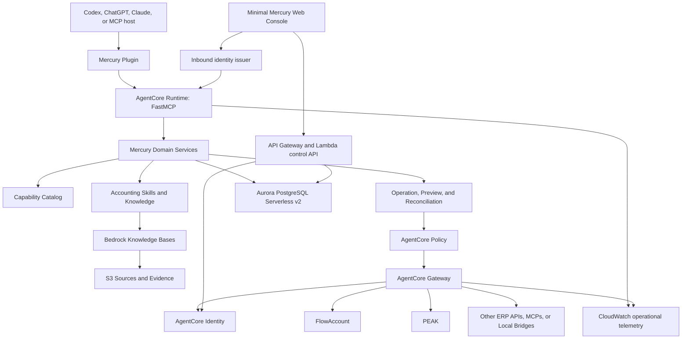
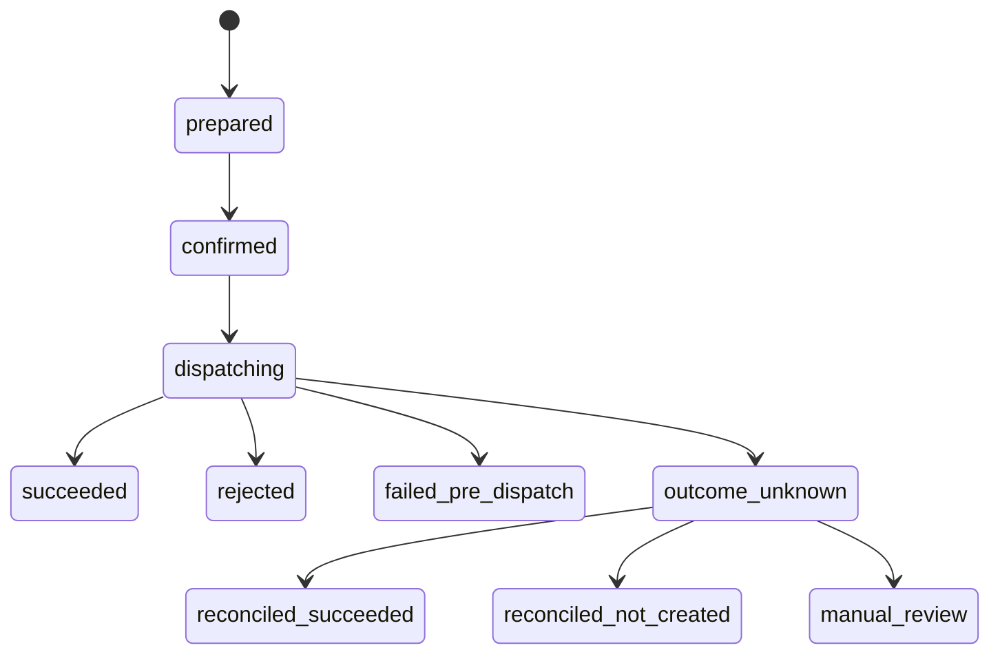

# Mercury V1 AWS-Primary AgentCore Design

Status: Owner-approved design; written spec ready for owner review
Date: 2026-08-01
Target release: `v1.0.0`
Repository: `mercury-tools`
Baseline commit: `71622d7729c81196c60bb3e65a424cca5a54f6a3`

## 1. Authority and Supersession

This document is the canonical architecture and delivery specification for
Mercury V1.

It preserves the accounting-domain contracts approved in
`2026-07-25-mercury-v1-authorization-gateway-design.md`, including the
Capability Catalog, provider normalization, cited knowledge, Skills, immutable
preview, explicit confirmation, idempotency, reconciliation, and sanitized
accounting audit.

It supersedes that document wherever the older document refers to:

- Render as the production runtime
- Supabase as the production identity, database, RAG, or audit backend
- a public unauthenticated Mercury MCP
- read and document Create as the only provider operations
- a hybrid or dual-running migration

Current Render and Supabase records are test data. They are not production
customer records and will not be migrated into the new production database.

## 2. Executive Summary

Mercury V1 is an MCP-first accounting SaaS. A customer installs one Mercury
plugin in Codex, ChatGPT, Claude, or another compatible MCP host. The host
supplies the reasoning model and agent loop. Mercury supplies:

- one product-facing Streamable HTTP MCP server
- tenant and company workspaces
- ERP connection and credential orchestration
- a reviewed, versioned Capability Catalog
- complete platform support for qualified reads and mutations
- cited accounting, tax, provider, and endpoint knowledge
- versioned accounting Skills and workflows
- immutable Thai previews and explicit approval
- idempotency, outcome reconciliation, and accounting-aware audit

Amazon Bedrock AgentCore is the primary backend platform. FastMCP implements
the public MCP protocol surface inside AgentCore Runtime. AgentCore Gateway,
Identity, and Policy provide managed connector routing, credential exchange,
and authorization controls. Aurora PostgreSQL, S3, and Bedrock Knowledge Bases
store product state and cited knowledge.

Mercury does not include its own chat product, customer-facing model, or
AgentCore Harness loop. Customers continue using the AI host they already have.

## 3. Product Boundary

### 3.1 Customer-facing surfaces

Mercury V1 has two coordinated surfaces:

1. **Mercury Plugin and MCP**
   - installed once from a supported marketplace
   - used from the customer's existing AI host
   - handles finance questions, qualified ERP operations, Skills, and cited
     knowledge

2. **Mercury Web Console**
   - sign in and workspace selection
   - connector setup and company binding
   - pending approvals
   - sanitized audit history
   - members, plans, and entitlement administration

The Web Console is a control plane. It is not a chat application and does not
attempt to replace the connected ERP.

### 3.2 Non-goals

The following are not part of Mercury V1:

- Mercury-owned general chat or model subscription
- an AgentCore Harness agent loop
- customer-provided OpenAI, Anthropic, or Bedrock model keys
- unrestricted arbitrary HTTP requests
- model- or RAG-authorized ERP execution
- automatic ingestion of customer accounting records into general RAG
- a second product-facing provider MCP
- a dual-write Render/Supabase/AWS production period
- a separate release-control repository

Payment collection provider selection is a separate commercial integration.
V1 defines plans and entitlements but does not make payment-provider selection
a backend migration dependency.

## 4. Approaches Considered

### 4.1 Selected: AgentCore Runtime with an Aurora relational core

Mercury keeps its tested Python domain logic and PostgreSQL transaction model,
hosts FastMCP in AgentCore Runtime, and uses managed AgentCore services around
it. This minimizes rewrites while removing generic infrastructure work.

### 4.2 Rejected: Gateway/Lambda plus DynamoDB rewrite

This approach would maximize serverless decomposition but would require a large
rewrite of tenant state, capability versioning, operation transitions,
idempotency, and relational audit behavior that already have PostgreSQL tests.

### 4.3 Rejected: Hybrid Render/Supabase and AWS

Running two backends would create unclear ownership, duplicate identity and
credential systems, dual-write risk, and an open-ended migration period. The
current data is test-only, so a direct AWS target is lower risk.

## 5. Target Architecture



### 5.1 Component responsibilities

| Component | Responsibility |
| --- | --- |
| FastMCP | MCP tools, resources, prompts, exact schemas, transport, and MCP Apps resources |
| AgentCore Runtime | Managed hosting, scaling, sessions, versions, and runtime isolation |
| AgentCore Gateway | Qualified API, Lambda, MCP, and connector target routing |
| AgentCore Identity | Outbound OAuth, API keys, custom tokens, and credential vault access |
| AgentCore Policy | Deterministic authorization before provider execution |
| Aurora PostgreSQL | Product, catalog, operation, audit, and knowledge metadata state |
| S3 | Canonical knowledge sources, published Skills, and retained evidence artifacts |
| Bedrock Knowledge Bases | Cited chunk retrieval and semantic search |
| Web Console | Identity, workspace, connector, approval, audit, member, and plan controls |
| CloudWatch | Operational metrics, traces, alarms, and sanitized logs |

## 6. FastMCP and AgentCore Boundary

The first AgentCore deployment retains the repository's pinned official MCP
Python SDK and its bundled FastMCP API:

```python
from mcp.server.fastmcp import FastMCP
```

This is already exercised by the Mercury MCP contract suite and matches the
FastMCP form used in AgentCore MCP deployment examples.

The Runtime contract is:

- Streamable HTTP at `/mcp`
- container listener at `0.0.0.0:8000`
- stateless MCP operation by default
- all durable session, workspace, approval, and operation state in Aurora
- exact pinned dependency versions

The current `StrictInputFastMCP` wrapper depends on private MCP SDK internals.
Before adopting standalone `fastmcp`, Mercury must isolate those dependencies
behind a protocol adapter and pass the complete MCP contract suite. Standalone
FastMCP is a gated upgrade after the first AgentCore smoke deployment; it is not
part of the initial cloud migration critical path.

Mercury does not deploy to Prefect Horizon and does not use FastMCP Auth in
parallel with AgentCore identity controls.

## 7. AWS Environment and Delivery Model

### 7.1 Region

The primary region is Asia Pacific Singapore (`ap-southeast-1`). The selected
AgentCore Runtime, Gateway, Bedrock, Aurora, S3, KMS, and CloudWatch features
must all pass a deployment capability check in this region before production
resources are created.

### 7.2 Account isolation

Mercury uses separate AWS accounts from the beginning:

- `mercury-nonprod` for development, sandbox, UAT, and qualification
- `mercury-prod` for production customer traffic and provider credentials

The accounts do not share VPCs, databases, KMS keys, buckets, identity clients,
or credential vault entries.

### 7.3 Infrastructure as code

- AWS CDK in Python provisions standard AWS infrastructure.
- AgentCore CLI and checked-in declarative configuration provision Runtime,
  Gateway, Identity, and Policy resources.
- ECR stores immutable FastMCP container images.
- GitHub Actions assumes deployment roles through OIDC.
- No long-lived AWS access key is stored in GitHub.
- Production changes require reviewed infrastructure diffs and environment
  approval.

The AWS account is currently suspended pending owner verification. Repository,
contract, container, and IaC work may proceed offline, but no AWS deployment or
connectivity claim may be made until STS and service access succeed.

## 8. Data Architecture

### 8.1 Aurora PostgreSQL

Aurora PostgreSQL Serverless v2 is the system of record for:

- tenants, users, memberships, and workspaces
- company and provider account bindings
- connector profile references and validation state
- capability definitions, versions, qualification evidence, and quarantine
- immutable previews, confirmations, operations, and child batch operations
- idempotency keys, reconciliation attempts, and provider evidence references
- sanitized accounting audit events
- Skill publication metadata and knowledge-source metadata
- plan and entitlement assignments

Tenant isolation is enforced in service code and PostgreSQL row-level policies.
Every transaction receives an authenticated tenant and workspace context.
Administrative paths use separate roles and cannot be reached with customer MCP
tokens.

### 8.2 S3 and Bedrock Knowledge Bases

S3 stores versioned canonical source artifacts:

- official accounting and tax references
- official ERP API documentation and OpenAPI/Postman artifacts
- first-party Skill releases published from Git
- qualification evidence artifacts
- retained audit evidence that does not belong in relational rows

Bedrock Knowledge Bases ingests approved S3 sources. Its vector data uses a
separate schema and table from transactional product state. Retrieval returns
source title, source URI, version, effective date, jurisdiction, connector, and
chunk identifier.

RAG is evidence and guidance. It never enables an endpoint, grants a role,
selects a production environment, or authorizes a mutation.

### 8.3 Sensitive business data

Provider credentials never enter Aurora operation records, RAG, MCP output,
widgets, logs, or Git.

Business fields needed to prepare or reconcile an operation may pass through
Mercury and may be retained in encrypted preview or evidence storage for a
bounded period. Audit rows store sanitized summaries and hashes rather than raw
provider payloads. Retention classes are configurable and must be reviewed
against applicable accounting and privacy obligations before general
availability.

## 9. Identity and Credential Model

### 9.1 Inbound user identity

One identity issuer serves both the MCP plugin and Web Console. Access tokens
bind:

- `user_id`
- `tenant_id`
- `workspace_id`
- role
- plan entitlements
- allowed client and audience

Normal tools derive workspace context from the token rather than asking the
model to supply a workspace UUID. A user with multiple workspaces selects one
during authorization. Switching workspaces performs a new authorization or
token exchange and produces a token bound to the new workspace.

The identity selection gate is deterministic:

1. prove the required Codex, ChatGPT, and Claude client flows with pre-registered
   Cognito clients;
2. if any required one-click host requires Dynamic Client Registration, use one
   DCR-capable external issuer for both MCP and Web Console;
3. never split customer identity between Cognito and an external issuer.

AgentCore Runtime validates the selected issuer's JWT. Core runtime, data,
policy, and audit remain on AWS even if an external identity issuer is required.

### 9.2 Outbound provider identity

- FlowAccount uses user-delegated OAuth when the qualified provider contract
  supports it.
- PEAK uses provider-issued User Token, Connect ID, and Connect Key through an
  AgentCore credential provider or a Secrets Manager-backed credential
  provider.
- Other ERP systems use OAuth, API key, client certificate, or custom token
  providers according to their reviewed manifest.

AgentCore Identity binds credential access to the Mercury workload and end user.
Aurora stores only opaque credential-provider references and exact provider
account bindings.

Provider credentials are entered only through a provider consent page or the
Mercury secure connector form. They never pass through chat or MCP tool
arguments.

## 10. Connector Integration Modes

Mercury supports four connector modes:

1. **Native provider MCP** through an AgentCore MCP target.
2. **OpenAPI REST API** through an AgentCore OpenAPI target.
3. **Complex API adapter** through Lambda or a Mercury provider adapter for
   multipart, custom signing, unsupported schema composition, or specialized
   reconciliation.
4. **Customer Local Bridge** for an on-premises ERP with no safe public API.

Mercury remains the only product-facing MCP. Provider MCP names and credentials
are internal implementation details.

Server URLs are allowlisted by connector manifest and environment. No tool may
accept a fully dynamic host or arbitrary destination URL.

## 11. Full ERP Operations

Mercury's platform supports every qualified provider action, including:

- `GET` reads, lists, searches, and exports
- `POST` creates and provider commands
- `PUT` and `PATCH` updates
- `DELETE` removals
- semantic actions such as void, cancel, approve, send, payment, post-journal,
  attach, and upload

"Supported" means that the provider publishes the action, the customer's
account is authorized for it, and the exact capability version has passed
qualification. Mercury never invents an unsupported delete when a provider
offers only void or cancel.

### 11.1 Capability Catalog authority

Every executable capability records:

- provider, environment, API/MCP version, and provider operation identifier
- HTTP method and allowlisted path or MCP tool name
- normalized Mercury business action
- exact request and response schemas
- authentication type and required scopes
- read, write, destructive, and idempotent classification
- response sanitizer and evidence extraction
- preview renderer and approval class
- idempotency and reconciliation strategy
- qualification evidence, expiry, owner, and current state

Capability states are:

```text
discovered_unreviewed
-> schema_validated
-> sandbox_qualified
-> production_canary_passed
-> enabled
```

Any state may move to `quarantined` when schema drift, unsafe behavior, expired
evidence, or operational failures are detected. Quarantine affects the exact
provider, operation, version, and environment rather than disabling all of
Mercury.

### 11.2 Public tool publication

Enabled reads are published as exact-schema FastMCP tools. Enabled mutations
are published as exact-schema prepare tools whose names use a stable bounded
provider and operation alias. No public mutation tool accepts an untyped body or
arbitrary URL.

The stable operation tools are:

- `render_operation_preview`
- `confirm_erp_operation`
- `get_operation_status`
- `reconcile_erp_operation`

Catalog and Skill discovery tools help the host choose an enabled exact tool
without publishing thousands of schemas into every prompt. Tool annotations
must correctly declare read-only, destructive, idempotent, and open-world
behavior.

## 12. Connector Learning and Qualification

### 12.1 Accepted source formats

- provider MCP discovery
- OpenAPI 3.x
- Postman collections
- official HTML/PDF/Markdown documentation
- reviewed custom adapter manifests

### 12.2 Pipeline

```text
ingest versioned source
-> discover endpoint candidates
-> build draft catalog entries
-> validate exact schemas
-> classify action and risk
-> run non-production contract tests
-> record qualification evidence
-> run owner-authorized production canary
-> publish enabled tools
```

OpenAPI discovery is deterministic. Unstructured documentation may be converted
into candidate catalog entries with maintainer AI tooling, but those candidates
remain `discovered_unreviewed` until deterministic validation and human review
complete. Mercury V1 does not run a hidden production LLM that can authorize a
connector.

Known, centrally qualified provider versions are reusable by all customers.
Each customer validates only credentials, provider account binding, scopes, and
workspace authorization. A customer does not repeat global endpoint
qualification during onboarding.

## 13. Runtime Flows

### 13.1 Read

```text
host selects an exact read capability
-> Mercury resolves token-bound workspace and connector
-> Policy checks role, entitlement, environment, and capability version
-> Gateway injects provider credential
-> provider read executes
-> Mercury sanitizes and normalizes response
-> cited result and sanitized audit are returned
```

### 13.2 Mutation

```text
exact mutation prepare tool
-> validate schema, role, account binding, and catalog authority
-> fetch current provider state when needed
-> persist immutable encrypted preview
-> render Thai preview or text fallback
-> explicit confirmation
-> revalidate authority and preview hash
-> dispatch exactly once
-> verify or reconcile result
-> return structured outcome and sanitized audit reference
```

Create previews show the complete proposed document. Update previews show before
and after values. Delete, void, payment, post, approval, and send previews show
the target and expected effect.

### 13.3 Role model

| Role | Default ability |
| --- | --- |
| Viewer | Qualified reads and reports |
| Operator | Prepare Create and Update previews |
| Approver | Confirm qualified mutations |
| Owner | All workspace, connector, policy, member, and operation controls |

The first member of a single-owner workspace is Owner.

### 13.4 Automation policies

Unattended writes require an owner-created standing policy that binds provider,
environment, company, capability version, document type, value/count limits,
schedule or trigger, expiry, and approver. Without such a policy, every mutation
requires one explicit human confirmation.

## 14. Operation State, Idempotency, and Reconciliation



- `failed_pre_dispatch` requires evidence that no provider request was sent.
- `rejected` requires a deterministic provider rejection.
- `outcome_unknown` means a request may have reached the provider but Mercury
  cannot prove the outcome.
- `outcome_unknown` is never automatically replayed.
- Reconciliation queries the provider by provider idempotency key, external
  reference, or reviewed natural key before another dispatch is considered.
- A confirmed immutable preview binds payload hash, connector revision,
  capability version, company, environment, actor, and expiry.
- Provider-native idempotency is used when available. Otherwise Mercury uses a
  workspace lock, operation fingerprint, unique constraints, and post-dispatch
  provider lookup.

The existing Task 13 transition conflict must be resolved explicitly. A proven
pre-dispatch failure may transition from `dispatching` to
`failed_pre_dispatch` only when persisted evidence states `request_sent=false`.
The Python and PostgreSQL transition authorities must implement the same rule.

For a batch, one confirmation may bind one immutable batch preview. Every child
has an independent operation and idempotency identity. A rejection or unknown
outcome stops undispatched children. Mercury does not claim rollback for
provider records already created or changed.

## 15. Skills and Knowledge

Git remains canonical for first-party Skills. A release pipeline publishes
versioned Skill artifacts to S3 and metadata to Aurora. The MCP exposes Skill
catalog, schema, and content through bounded tools and resources.

The installable plugin bundles the routing Skills needed by the host and pins
them to a Mercury release. The same release publishes canonical server-side
Skill artifacts. A plugin and server version mismatch is reported explicitly;
it never silently changes the execution contract.

Knowledge is partitioned by:

- jurisdiction
- provider and connector
- document and endpoint type
- review status
- source version and effective date
- workspace scope when customer-specific knowledge is allowed

Every retrieved chunk carries a citation. Customer ERP records do not enter the
general knowledge base. A Skill can require capabilities and evidence, but it
cannot bypass the Capability Catalog, role, policy, preview, or confirmation
engine.

Mercury remains composable with Google Sheets, Drive, Gmail, marketplace, bank,
and other MCPs connected by the customer's host. The host coordinates those
tools; Mercury does not copy or own their credentials. Mercury Skills declare
required external evidence and accept bounded artifacts or references so a
workflow can combine external data with qualified ERP operations.

## 16. One-click Plugin and Web Console

### 16.1 Installation

```text
install Mercury plugin
-> host starts Mercury authorization
-> user signs in
-> user selects or creates a workspace
-> token is issued for that workspace
-> MCP is ready
```

The plugin contains the canonical AgentCore-backed MCP URL and declares
authentication on install. It contains no static bearer token, provider secret,
Supabase key, Render token, or AWS credential.

### 16.2 First connector use

If no connector is ready, Mercury returns a concise structured
`connector_authorization_required` result with a secure browser URL. The user
finishes provider OAuth or credential setup outside chat. Mercury then validates
the exact company/account and reports enabled capabilities.

### 16.3 Web Console boundary

The Web Console contains only:

- sign in and workspace selection
- connectors and provider account binding
- pending previews and approvals
- sanitized audit
- members and roles
- plans and entitlements

It does not include Mercury Chat. Supported hosts may render the Thai preview as
an MCP Apps widget. Other hosts receive complete structured and text fallbacks.

## 17. Audit, Security, and Operations

### 17.1 Domain audit

Every material action records:

- timestamp and correlation id
- tenant, workspace, actor, and role
- connector, provider account, and environment
- capability id and exact version
- action class and operation state
- sanitized input and output hashes
- preview, approval, dispatch, and reconciliation evidence references
- final certainty and error class

Raw bearer tokens, API keys, refresh tokens, and provider client secrets are
never stored in domain audit.

### 17.2 Operational telemetry

CloudWatch captures sanitized runtime and Gateway metrics, traces, and alarms.
Minimum alarms cover:

- authentication and authorization failure rate
- provider 401, 429, and 5xx rates
- Gateway and provider latency
- operation `outcome_unknown` rate
- reconciliation backlog
- schema drift and quarantined capabilities
- Aurora capacity, connections, and storage
- knowledge ingestion and retrieval failures

CloudWatch complements but does not replace accounting-domain audit.

### 17.3 Kill switches

An authorized operator can disable:

- one capability version
- one provider or connector
- one workspace connection
- one environment
- all provider mutations
- the complete Mercury MCP service

Credential revocation does not require a code deployment.

### 17.4 Infrastructure security

- encryption in transit and at rest
- KMS keys separated by account and environment
- private Aurora networking
- non-root Runtime containers and current AgentCore metadata protection
- egress allowlists for provider targets
- least-privilege runtime and deployment roles
- secret and dependency scanning in CI
- no production secret in Git, CI output, test fixtures, or release artifacts

## 18. Testing Strategy

### 18.1 Unit and contract

- exact tool input/output schemas and no unclear-argument warnings
- catalog normalization and qualification state transitions
- connector manifests and URL allowlists
- response sanitization and secret redaction
- authorization, role, and entitlement decisions
- immutable preview identity
- operation transitions, idempotency, and reconciliation
- RAG citation and scope behavior

### 18.2 AWS integration

- AgentCore Runtime MCP initialization, tools, resources, and prompts
- inbound JWT and workspace binding
- Gateway target invocation and credential injection
- AgentCore Policy allow and deny behavior
- Aurora tenant isolation and transaction behavior
- S3/Knowledge Base ingestion and cited retrieval
- CloudWatch sanitization and alarms

### 18.3 Provider certification

- FlowAccount sandbox followed by an owner-authorized production canary
- PEAK UAT or a dedicated owner-authorized test merchant followed by a
  production canary
- GET, POST, PUT, PATCH, DELETE, or semantic alternatives according to each
  provider's published API
- expired or revoked credentials, wrong company, insufficient scope, 401, 429,
  5xx, schema drift, and malformed responses
- duplicate confirmation, concurrency, timeout before dispatch, timeout after
  possible dispatch, and partial batch completion

### 18.4 Plugin end-to-end

- installation from a clean account without local runtime or manual MCP URL
- authorization and workspace selection
- connector setup without secrets in chat
- read, preview, confirmation, operation status, and audit
- Thai widget on supported hosts and complete text fallback elsewhere
- desktop and mobile host paths required by the selected marketplace

## 19. Capability Coverage Reporting

For each provider version and environment Mercury publishes counts for:

- documented
- discovered
- schema validated
- sandbox qualified
- production enabled
- unsupported by provider
- quarantined

Mercury does not claim complete provider coverage unless the report supports
that claim. Every enabled endpoint has exact qualification evidence. Endpoints
may graduate independently without waiting for the complete provider catalog.

## 20. Release Gate for `v1.0.0`

The release requires:

- one-click plugin installation against the AgentCore-backed MCP
- authenticated tenant and workspace isolation
- FlowAccount and PEAK connection to the exact selected company/account
- qualified core read, Create, Update, and Delete-or-Void behavior according to
  what each provider publishes
- a visible status for every cataloged endpoint
- qualification evidence for every enabled endpoint
- exact schemas with no unclear-argument warnings
- immutable previews and one explicit confirmation per mutation
- duplicate confirmation proven not to duplicate provider actions
- ambiguous outcomes blocked from automatic replay and successfully routed to
  reconciliation or manual review
- successful backup and restore rehearsal
- an owner-approved data retention schedule for production previews, evidence,
  audit, and operational logs
- verified capability, provider, workspace, and global kill switches
- no credential in Git, logs, model output, widgets, RAG, audit, or release
  artifacts
- an owner-authorized production canary for each launch provider
- the plugin canonical MCP URL pointing to AWS
- live Render and Supabase services deleted and their secrets revoked after
  cutover; non-secret historical repository evidence may remain

The release does not wait for every documented endpoint to become enabled.
Platform support covers all operation classes, while provider coverage is
published honestly and grows one qualified capability at a time.

## 21. Direct Migration Waves

This is a program-level architecture specification, not one oversized coding
plan. Each Wave receives its own bounded implementation plan, verification
evidence, review, and owner approval. A later Wave may not begin merely because
an earlier plan contains remaining token or time budget.

Every Wave follows this gate:

```text
read the current Space
-> execute only the current Wave
-> run tests and security checks
-> record evidence and update progress
-> review the Wave
-> stop for owner approval
```

### Wave 0: AWS access and architecture readiness

- restore AWS account access
- create nonprod and production accounts
- verify Singapore service availability and quotas
- prove GitHub OIDC and local STS access
- finalize the identity compatibility result

### Wave 1: AWS foundation

- CDK project and environment configuration
- VPC, KMS, ECR, S3, Aurora, budgets, and baseline CloudWatch
- no customer or provider data

### Wave 2: FastMCP Runtime and inbound identity

- package the current MCP server for AgentCore Runtime
- configure Streamable HTTP `/mcp`
- configure one inbound identity issuer
- pass MCP and workspace isolation smoke tests

### Wave 3: Product data, Skills, and knowledge

- port PostgreSQL schema and product stores to Aurora
- publish clean seed Catalog, Skills, and reviewed knowledge sources
- configure Bedrock Knowledge Bases
- do not import test tenants, credentials, operations, or audit

### Wave 4: Connector reads and qualification

- AgentCore Gateway and Identity credential providers
- FlowAccount and PEAK connection flows
- safe reads and capability coverage reporting
- connector learning pipeline and quarantine

### Wave 5: Full ERP operations

- resolve the Task 13 state-transition conflict
- exact mutation prepare tools
- preview, confirmation, dispatch, idempotency, reconciliation, and batch behavior
- POST, PUT, PATCH, DELETE, and semantic provider actions by qualification

### Wave 6: One-click product surfaces

- marketplace plugin artifacts
- install-time authentication
- minimal Web Console
- Thai MCP Apps preview and text fallback

### Wave 7: Certification and release candidate

- provider non-production qualification
- failure, security, load, backup, and restore tests
- owner-authorized production canaries
- public capability coverage report

### Wave 8: Cutover and `v1.0.0`

- switch the plugin canonical MCP URL to AWS once
- verify clean-install production use
- delete live Render/Supabase services, revoke their secrets, and remove active
  deployment configuration
- tag and publish `v1.0.0`

There is no dual-write or synchronized production migration. The legacy service
is frozen as a reference until the single URL cutover, then decommissioned.

## 22. Cost Boundary

Mercury V1 does not run a general customer chat model. The customer's host
supplies reasoning. Primary Mercury costs are:

- AgentCore Runtime and Gateway invocation
- Aurora PostgreSQL capacity and storage
- S3 and Bedrock Knowledge Base ingestion/retrieval
- Identity, KMS, Lambda, API Gateway, and CloudWatch usage

Nonprod and production budgets and alarms are provisioned in Wave 1. Expensive
optional AgentCore features, including Harness and conversational Memory, are
not enabled without a separate owner-approved design.

## 23. Definition of Done

Mercury V1 is complete when a new customer can:

1. install one Mercury plugin without a local server or manual MCP URL;
2. sign in and select a company workspace;
3. connect a qualified ERP without placing credentials in chat;
4. ask a finance question and receive normalized evidence with citations;
5. prepare, preview, approve, and execute an enabled provider mutation;
6. inspect an operation's certainty, reconciliation, and audit evidence;
7. use the same Mercury surface as additional ERP capabilities graduate;
8. do all of the above against the AWS production backend with no dependency on
   Render or Supabase.

## 24. Primary Technical References

- [Amazon Bedrock AgentCore overview](https://docs.aws.amazon.com/bedrock-agentcore/latest/devguide/what-is-bedrock-agentcore.html)
- [Deploy MCP servers in AgentCore Runtime](https://docs.aws.amazon.com/bedrock-agentcore/latest/devguide/runtime-mcp.html)
- [AgentCore MCP protocol contract](https://docs.aws.amazon.com/bedrock-agentcore/latest/devguide/runtime-mcp-protocol-contract.html)
- [AgentCore Gateway](https://docs.aws.amazon.com/bedrock-agentcore/latest/devguide/gateway.html)
- [AgentCore OpenAPI targets](https://docs.aws.amazon.com/bedrock-agentcore/latest/devguide/gateway-schema-openapi.html)
- [AgentCore Identity credential providers](https://docs.aws.amazon.com/bedrock-agentcore/latest/devguide/identity-outbound-credential-provider.html)
- [AgentCore OAuth and JWT authorization](https://docs.aws.amazon.com/bedrock-agentcore/latest/devguide/runtime-oauth.html)
- [AgentCore supported Regions](https://docs.aws.amazon.com/bedrock-agentcore/latest/devguide/agentcore-regions.html)
- [Aurora PostgreSQL as a Bedrock Knowledge Base](https://docs.aws.amazon.com/AmazonRDS/latest/AuroraUserGuide/AuroraPostgreSQL.VectorDB.html)
- [FastMCP documentation](https://gofastmcp.com/getting-started/welcome)
- [FastMCP upgrade from the MCP SDK](https://gofastmcp.com/getting-started/upgrading/from-mcp-sdk)
