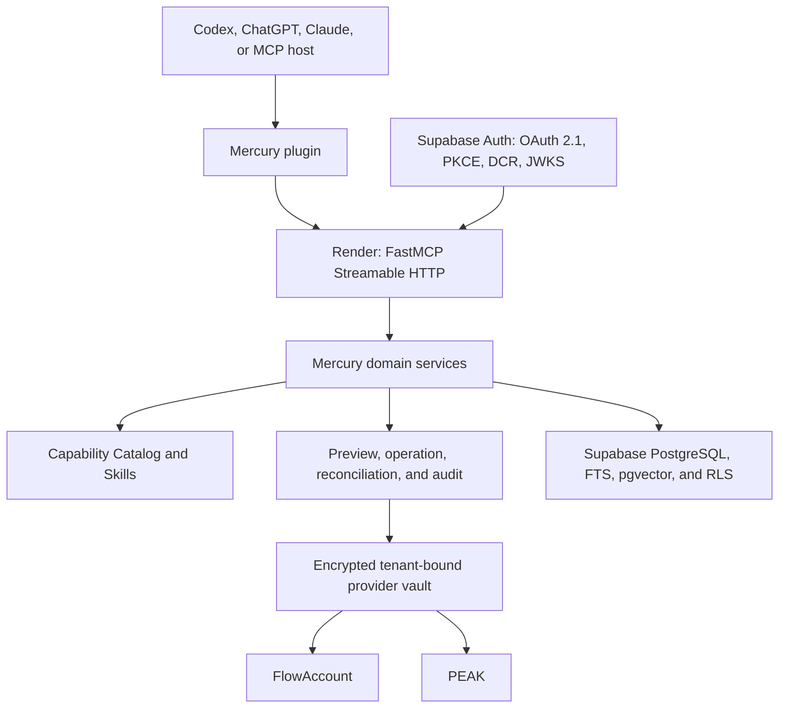

# Mercury V1 Render and Supabase Primary Design

Status: Owner-approved architecture pivot
Date: 2026-08-06
Target release: `v1.0.0`
Repository: `mercury-tools`
Baseline commit: `d27d444`

## 1. Authority and Supersession

This document is the infrastructure and delivery authority for Mercury V1.

It supersedes the AWS-only infrastructure, migration, and release requirements
in `2026-08-01-mercury-v1-aws-primary-agentcore-design.md`. That AWS design is
paused as an optional future deployment target while the required AgentCore
quota remains unavailable. Existing AWS code, tests, and evidence stay in Git
and are not part of the Render deployment.

This document preserves the approved Mercury product contracts:

- Mercury is the only product-facing MCP server.
- The customer's Codex, ChatGPT, Claude, or compatible host supplies the LLM.
- The Capability Catalog is execution authority; RAG and Skills cannot enable
  an endpoint.
- Provider credentials never enter chat, model context, widgets, RAG, logs,
  audit output, or Git.
- Mutations use immutable preview, explicit confirmation, single dispatch,
  idempotency or outcome reconciliation, and sanitized audit.
- Mercury does not add a customer-facing chat application.

## 2. Goal and Product Boundary

Mercury V1 is one OAuth-protected, Streamable HTTP MCP service hosted on
Render. Supabase provides inbound identity, PostgreSQL product state, cited
knowledge, workspace isolation, operation state, and audit storage.

Mercury continues to support provider-neutral ERP connectors. FlowAccount is
qualified first, followed by PEAK. Express remains a future Local Bridge until
it has a supported remote API or MCP authorization contract.

The current Supabase project and Render service are the V1 pilot environment.
Existing rows are test data and must not be represented as production customer
records. No new cloud account or dual-write backend is required for V1.

## 3. Architecture



### 3.1 Render responsibilities

- Run the existing Python FastMCP container at `/mcp` with Streamable HTTP.
- Terminate TLS, run health checks, deploy from GitHub, and provide rollback.
- Supply runtime configuration and encryption keys through secret-backed
  environment variables. Secret values never appear in `render.yaml`.
- Publish only health, legal/support, OAuth discovery/consent, and authenticated
  MCP routes.

### 3.2 Supabase responsibilities

- Act as the Mercury OAuth 2.1 authorization server using Authorization Code
  with PKCE, refresh token rotation, JWKS, and MCP-compatible dynamic client
  registration.
- Store users, tenants, workspaces, memberships, plans, connector bindings,
  catalog projections, knowledge, Skills, previews, operations, and sanitized
  audit events in PostgreSQL.
- Enforce tenant and user boundaries with RLS on every exposed table.
- Use PostgreSQL full-text search as the required V1 retrieval path. Semantic
  embeddings are optional; deterministic hash embeddings are test-only and may
  not be marketed as semantic retrieval.

### 3.3 Mercury responsibilities

- Validate JWT issuer, audience, signature, expiry, user, tenant, workspace,
  role, and entitlement before protected tool execution.
- Encrypt provider credentials before persistence. The encryption master key
  stays only in the Render secret store; encrypted provider values remain
  separate from knowledge and audit output.
- Route only exact provider, API version, environment, capability, and schema
  entries promoted to `enabled` after qualification.
- Preserve immutable operation state and sanitized evidence for every read and
  mutation.

## 4. Authentication and Public Surface

Production uses:

```text
MERCURY_V1_ENABLED=true
MERCURY_TOOLS_HTTP_REQUIRE_AUTH=true
MERCURY_TOOLS_ENABLE_LEGACY_HTTP_API=false
```

Unauthenticated access is limited to:

- `/healthz`
- `/privacy`
- `/terms`
- `/support`
- OAuth protected-resource metadata
- the first-party login and consent handoff required by Supabase Auth
- provider OAuth callback routes, which validate signed state and never expose
  provider tokens

The `/mcp` tool surface requires a valid Mercury access token. The service role
key is server-only and cannot be returned to a browser, plugin, or MCP client.

Supabase OAuth Server is a beta dependency. Before V1 release Mercury must prove
discovery, dynamic registration, PKCE, refresh, revocation, exact redirect URI
handling, JWT validation, and RLS isolation against the configured project.

## 5. Provider Execution

Mercury supports all provider-published operation classes, but catalog presence
does not enable execution. Each exact operation starts as
`discovered_unreviewed` and is enabled only after schema and environment
qualification.

Reads require an authenticated tenant-bound provider connection and produce
sanitized evidence. Mutations follow:

```text
prepare -> validate -> immutable Thai preview -> explicit confirmation
        -> dispatch once -> verify or reconcile -> sanitized audit
```

Mercury never exposes an arbitrary URL, generic raw HTTP, or unrestricted ERP
mutation tool. A failed capability can be disabled without disabling the
provider or the whole Mercury service.

## 6. Data and Security

- Every exposed Supabase table has RLS and explicit ownership or membership
  predicates. `TO authenticated` alone is insufficient authorization.
- Authorization decisions use server-controlled membership and entitlement
  state, not user-editable metadata.
- Provider tokens, API keys, client secrets, passwords, raw tax IDs, and raw
  personal contact data are excluded from logs, RAG, audit output, fixtures,
  source control, and build artifacts.
- Provider connection records support refresh, revoke, disconnect, expiry, and
  encryption-key rotation.
- Unknown mutation outcomes are not retried automatically. Exact provider
  reconciliation or manual review is required.
- Database migrations are expand-only for the V1 release and must pass Supabase
  security and performance advisors.

## 7. Delivery and Recovery

The V1 release path is intentionally small:

1. Local lint, unit tests, MCP contract review, plugin validation, and secret
   scan.
2. Supabase schema/OAuth/RLS verification against the configured pilot project.
3. Render deployment from the reviewed GitHub commit.
4. Hosted health, OAuth discovery, unauthenticated rejection, authenticated MCP,
   workspace isolation, and safe tool smoke tests.
5. FlowAccount sandbox qualification, followed by an owner-authorized
   production canary. PEAK follows the same qualification gate.
6. Version `1.0.0`, clean plugin installation, and public release only after all
   release gates pass.

Recovery uses an exact capability disable, provider disconnect or credential
revocation, and Render rollback to the previous healthy deployment. AWS work is
not deleted and does not block this path.

## 8. Acceptance Criteria

Mercury V1 is release-ready only when all of the following are true:

- Render serves the expected commit at `/mcp` and `/healthz` reports V1 enabled,
  authentication required, Supabase connected, and no legacy HTTP API.
- An unauthenticated MCP request is rejected without leaking configuration.
- Codex or another supported host completes Supabase OAuth 2.1 with PKCE and can
  initialize the authenticated MCP session.
- Two test users cannot read or mutate each other's tenant, workspace,
  connector, preview, operation, or audit state.
- FlowAccount passes setup, company binding, at least one qualified read, and
  one sandbox document create through preview and explicit confirmation.
- PEAK passes the same gates before its capabilities are marketed as enabled.
- RAG returns citations from reviewed sources and never authorizes execution.
- Repeated confirmation cannot create a duplicate document.
- Full tests, Supabase advisors, Hosted MCP smoke, plugin validation, and secret
  scans pass on the exact released commit.

